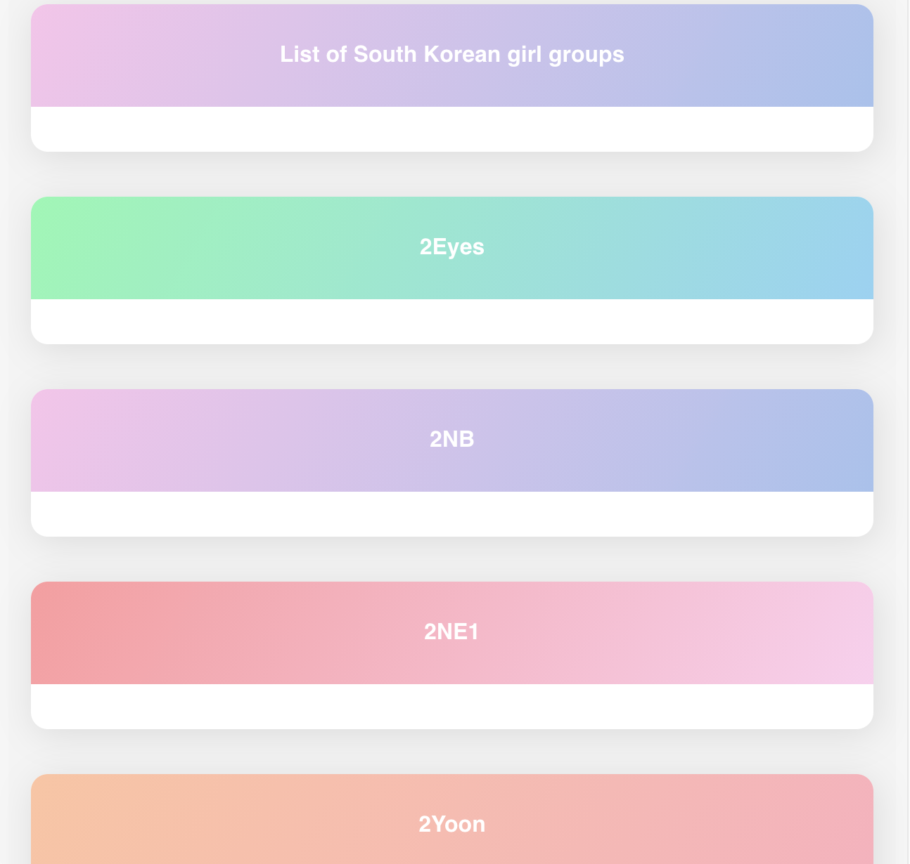

# KpopGirlGroups Wiki
Search engine for all KPOP girl groups and latest KPOP news on one platform using WikiAPI and GoogleNewsAPI.

Deployment
#Enable CORS by appending 'Access-Control-Allow-Origin: *' header to local and remote web requests when enabled
#Example- Use CORS Ublock chrome extension 
#run calendar.html 

Screenshots: 

#Homepage

#Rendered Page for searched group

#Interactive list of all groups

#Latest News

